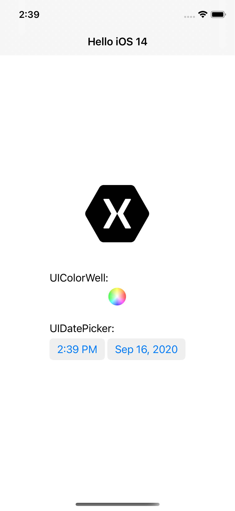
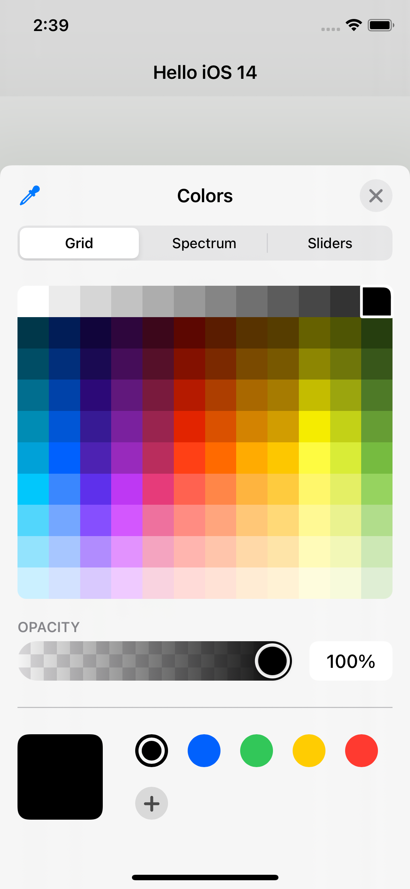
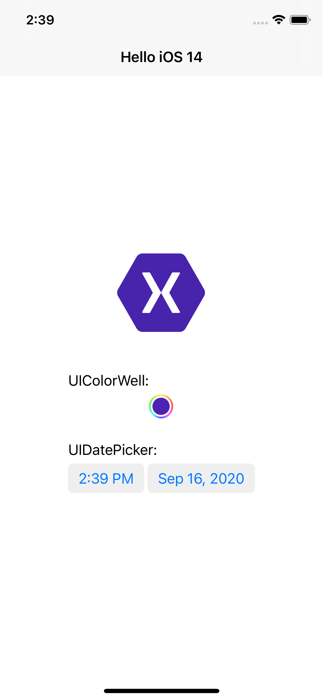
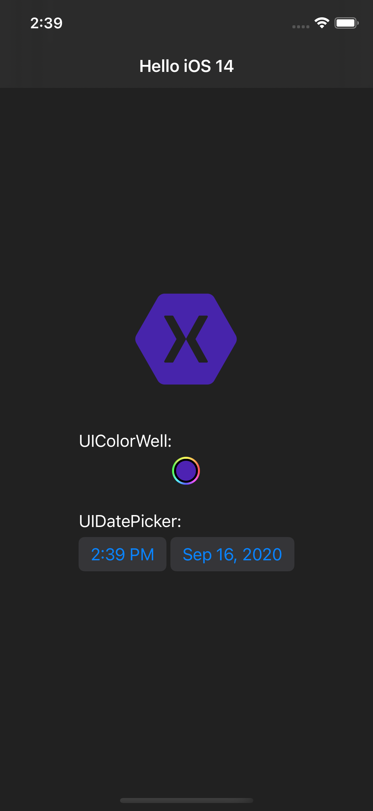

# Hello iOS 14

This is a simple app to showcase a few of the new UIKit features released with iOS 14, namely the UIColorWell and new styles for UIDatePicker.

The code here uses Xamarin.Forms [Native Views](https://docs.microsoft.com/en-us/xamarin/xamarin-forms/platform/native-views/) to show XAML with platform controls, and adds a reference to UIKit in the .NET Standard library for access to iOS 14.

This solution works splendidly with XAML Hot Reload!

